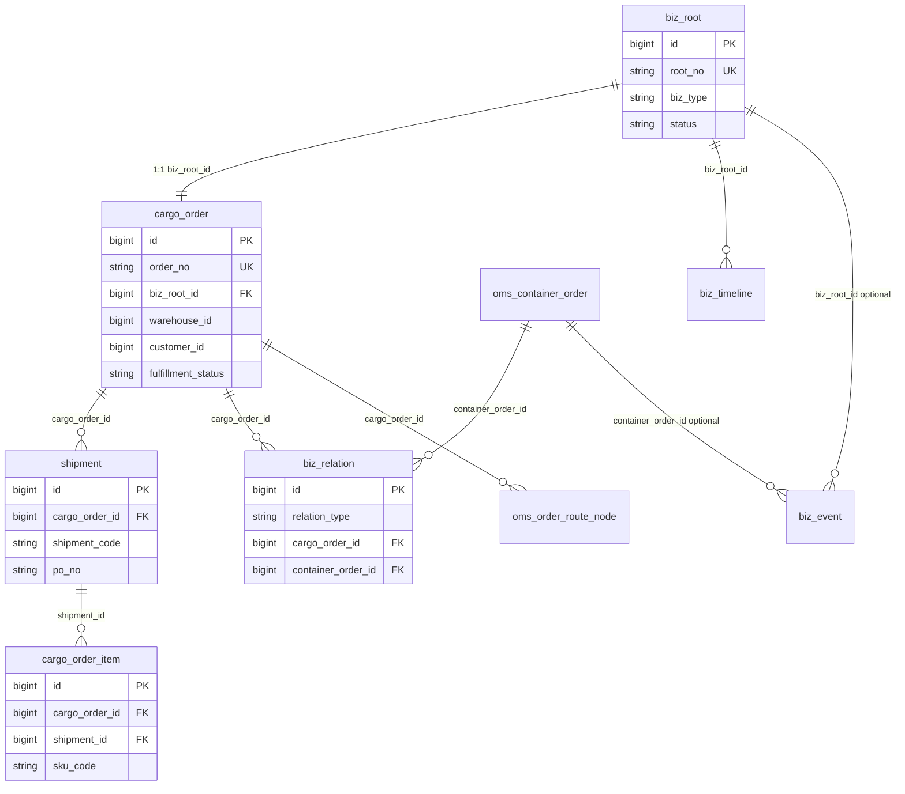

# 01 核心层（CORE）— 后端设计说明

> **定位**：海外仓 OMS/WMS 共用的「业务单据 + 关联 + 审计」内核，与具体海柜页面解耦。  
> **实现模块**：`yudao-module-oms` 中 `dal.dataobject.core` / `service.biz`  
> **SQL 基线**：`sql/mysql/oms-tables.sql`（CORE 段）+ `oms-tables-v11-alter.sql` + `oms-container-create-alter.sql`  
> **维护**：改表/改关联须同步本文档；接口路径见 `02-OMS-后端设计.md`  
> **版本**：2026-05（对齐前端 `cargo-order-display`、海柜建单 UI）

---

## 1. 文档说明

| 项 | 内容 |
|----|------|
| 读者 | 后端、产品、测试、联调 Agent |
| 不写什么 | 海柜 REST 路径、页面交互（见 OMS 文档） |
| 冲突顺序 | 概念以本文为准；**接口字段**以前端 `container/backend-integration.md` 为准 |

---

## 2. 核心概念（产品语义）

### 2.1 名词

| 概念 | 英文/表 | 说明 |
|------|---------|------|
| **业务主线** | `biz_root` | 一条委托单业务生命周期的逻辑根，用于时间轴、事件挂接；**不是**海柜主键 |
| **委托单** | `cargo_order` | 客户委托的履约单元，列表主键 **`cargo_order.id`** |
| **货件** | `shipment` | 委托单下 1:N 的 FBA/PO 维度；建单必填 `shipment_code、po_no、dw_date…` |
| **SKU 明细** | `cargo_order_item` | 货件下 0:N；`shipment_id` 关联货件 |
| **海柜工单** | `oms_container_order` | 物理柜维度工单，主键 **`oms_container_order.id`** |
| **装柜关系** | `biz_relation(LOADED_IN)` | 委托单装入海柜，**仅**通过此表关联，海柜表无 `biz_root_id` |

### 2.2 层级关系（一单多货件多 SKU）

```
海柜工单 oms_container_order (1)
    │  biz_relation LOADED_IN (N)
    ▼
委托单 cargo_order (N) ── biz_root (1:1)
    │
    ├── shipment (1:N)  ← 列表「货件编码/PO」聚合来源
    │       └── cargo_order_item (0:N, shipment_id)
    │
    ├── biz_timeline (按 biz_root_id)
    └── oms_order_route_node (按 cargo_order_id，履约路由 Tab)
```

### 2.3 与海柜的边界（红线）

| 规则 | 说明 |
|------|------|
| 海柜无 `biz_root_id` | 海柜事件可用 `container_order_id` 写 `biz_event` |
| 柜-单关联只用 `biz_relation` | 禁止在 `cargo_order` 上冗余 `container_order_id` 作为主关联 |
| 列表 `id` | 柜内/委托单列表行 **`id` = cargo_order.id**；禁止 `row_*` 调接口 |
| 跨模块 | 禁止 OMS 直接 Mapper 调 WMS；用事件/API |
| 状态 | 禁止魔法字符串散落；用 Enum + 服务内校验 |

---

## 3. 实体关系图



---

## 4. 表结构说明

> 以下字段为 **当前实现基线**（含 v11 + 建单增量）。租户字段 `tenant_id`、审计字段 `creator/create_time/.../deleted` 各表均有，表中不重复列出。

### 4.1 `biz_root` — 业务主线

| 项 | 说明 |
|----|------|
| **作用** | 委托单业务生命周期根；挂 **业务时间轴** `biz_timeline`；部分 **业务事件** `biz_event` |
| **创建时机** | 嵌套建单时每条 `cargo_order` 插入前生成一条；`root_no` 规则 `BR-YYYYMMDD-XXXXXX` |
| **不用于** | 海柜工单本身 |

| 字段 | 类型 | 说明 |
|------|------|------|
| `id` | bigint PK | |
| `root_no` | varchar(32) UK | 业务主线号 |
| `biz_type` | varchar(32) | 默认 `CARGO_ORDER` |
| `status` | varchar(32) | 如 `ACTIVE` |

**关联**：`cargo_order.biz_root_id` → `biz_root.id`（1:1）

---

### 4.2 `cargo_order` — 委托单

| 项 | 说明 |
|----|------|
| **作用** | 履约、派送、库存扣减的业务主体；柜内订单 Tab、订单追踪页的数据源 |
| **组织权限** | `@OrgDataScope` 过滤列 **`warehouse_id`** |
| **客户** | `customer_id` → `base` 模块客户（`mdm_client` / `BaseClientMapper`） |

| 字段分组 | 代表字段 | 来源/说明 |
|----------|----------|-----------|
| 标识 | `order_no` | 建单生成 `CO-YYYYMMDD-XXXXXX` 或传入 |
| 关联 | `biz_root_id`, `warehouse_id`, `warehouse_code`, `customer_id`, `end_customer_id` | 建单/基础资料 |
| 平台 | `platform`, `address_type`, `delivery_method` | 建单；`delivery_method` 枚举见 OMS 文档 §枚举 |
| 订单级汇总（兼容旧单） | `goods_name`, `shipment_code`, `po_no`, `planned_ctns` | 多货件后以 **shipment 表** 为准；订单级可空 |
| 度量 | `gross_weight_lbs/kg`, `cbm`, `wms_actual_ctns`, `wms_exception_ctns`, `calc_age_days` | 人工/WMS |
| 时间 | `lfd`, `dw_date`, `dw_start`, `dw_end` | 订单级 DW/LFD；货件级见 `shipment` |
| 收件 | `consignee_*`, `delivery_*`, `appointment_no` | 建单 |
| 状态 | `fulfillment_status`, `current_route_node`, `calc_risk_level` | OMS 流转 / 风险计算 |
| 标记 | `on_hold`, `remark`, `internal_remark`, `is_transfer`, `tms_order_id` | `on_hold` 订单级 HOLD；操作 hold 也可能改 `fulfillment_status` |

**关联**：

- → `biz_root`（1:1）
- → `shipment`（1:N）
- → `biz_relation`（N:可选 1 海柜）
- → `oms_order_route_node`（1:N）

---

### 4.3 `shipment` — 货件

| 项 | 说明 |
|----|------|
| **作用** | 委托单下独立货件（FBA Shipment ID、PO、DW、箱重体）；列表 **货件编码/PO 汇总列** 的数据来源 |
| **列表展示** | API 返回 `shipments[]` + `shipmentCodesAgg` / `poNosAgg`（逗号拼接） |

| 字段 | 类型 | 说明 |
|------|------|------|
| `id` | bigint PK | |
| `cargo_order_id` | bigint FK | 所属委托单 |
| `shipment_no` | varchar | 运单号（可选） |
| `shipment_code` | varchar | **必填（建单）** 货件编码 |
| `po_no` | varchar | **必填（建单）** |
| `dw_date` | date | **必填（建单）** |
| `dw_start` / `dw_end` | varchar | DW 时间窗 |
| `planned_ctns` | int | **必填（建单）** ≥1 |
| `gross_weight_lbs` | decimal | **必填（建单）** |
| `cbm` | decimal | **必填（建单）** |
| `goods_name` | varchar | **必填（建单）** |
| `carrier` | varchar | 承运商 |

**关联**：`cargo_order_item.shipment_id` → `shipment.id`

---

### 4.4 `cargo_order_item` — SKU 明细

| 项 | 说明 |
|----|------|
| **作用** | 货件下 SKU 计划数量；展开子表、详情 Tab2 |
| **可选** | 建单可不传 `items[]` |

| 字段 | 说明 |
|------|------|
| `cargo_order_id` | 所属委托单 |
| `shipment_id` | 所属货件（建单时写入） |
| `sku_code`, `sku_name`, `planned_qty` | 建单 VO |
| `qty` | 历史字段，与 `planned_qty` 并存 |

---

### 4.5 `biz_relation` — 业务关联

| 项 | 说明 |
|----|------|
| **作用** | **唯一** 表达「委托单装入海柜」 |
| **类型** | 当前实现：`LOADED_IN`（`OmsBizRelationTypeEnum`） |
| **唯一约束** | `(tenant_id, relation_type, cargo_order_id, container_order_id)` |

| 字段 | 说明 |
|------|------|
| `cargo_order_id` | 委托单 PK |
| `container_order_id` | 海柜 PK |
| `relation_type` | `LOADED_IN` |

**查询模式**：

- 按海柜查柜内单：`selectListByContainerOrderId` → 得 `cargo_order_id` 列表
- 按委托单查海柜：`selectListByCargoOrderIds` → 得 `container_order_id` → join 海柜头

---

### 4.6 `biz_event` — 业务事件（审计/集成）

| 项 | 说明 |
|----|------|
| **作用** | 幂等事件日志；WMS/TMS/OMS 写入；**事件日志页**数据源 |
| **挂接** | `biz_root_id` 和/或 `container_order_id` |

| 字段 | 说明 |
|------|------|
| `event_id` | 幂等 UK |
| `event_code` | 如 `CONTAINER_CREATED` |
| `status` | SUCCESS / FAILED / PENDING |
| `payload` | JSON |
| v11 扩展 | `biz_root_no`, `source_system`, `operator_*`, `consume_status` 等 |

**与 timeline 区别**：`biz_event` = 可重试、可消费的**事件流**；`biz_timeline` = 面向 UI 的**时间线展示**。

---

### 4.7 `biz_timeline` — 业务时间轴

| 项 | 说明 |
|----|------|
| **作用** | 委托单/海柜详情「业务事件」Tab；按 **`biz_root_id`** 查询 |
| **写入** | `OmsBizSupportService` 等在关键操作后插入 |

| 字段 | 说明 |
|------|------|
| `biz_root_id` | FK → 委托单主线 |
| `event_code`, `event_time`, `title`, `content` | 展示 |
| `operator_id`, `operator_name` | 操作人 |

---

### 4.8 `oms_order_route_node` — 订单履约路由节点

| 项 | 说明 |
|----|------|
| **作用** | 委托单详情 **Tab1 履约路由**（与 `biz_timeline` 不同） |
| **表名** | 代码 DO：`OmsRouteNodeDO` @TableName `oms_order_route_node` |
| **写入** | 建单 `initDefaultNodesIfAbsent`；状态变更 `syncFromFulfillmentStatus` |

| 字段 | 说明 |
|------|------|
| `cargo_order_id` | FK |
| `node_code`, `node_name`, `node_time`, `sort_order` | 节点定义 |
| `status` | `done` / `current` / `pending` |

---

## 5. 核心业务流程（逻辑）

### 5.1 嵌套建单时 CORE 写入顺序

（海柜头见 OMS 文档；此处仅 CORE 部分）

对每个 `orders[]` 元素：

1. `INSERT biz_root` → 得 `biz_root_id`
2. `INSERT cargo_order`（含 `delivery_method`、`on_hold`、收件人、度量等）
3. 对每个 `shipments[]`：`INSERT shipment`
4. 对每个 `items[]`：`INSERT cargo_order_item`（带 `shipment_id`）
5. `INSERT biz_relation`（`LOADED_IN`, `cargo_order_id`, `container_order_id`）
6. `initDefaultNodesIfAbsent(cargo_order_id)`

**事务**：与海柜头同一 `@Transactional`，任一步失败全部回滚。

### 5.2 列表货件聚合（读模型）

| 步骤 | 说明 |
|------|------|
| 1 | 批量 `shipment WHERE cargo_order_id IN (...)` |
| 2 | 组装 `shipments[]`（列表默认**不含** `items`） |
| 3 | `shipmentCodesAgg` = 非空 `shipment_code` 去重逗号拼接 |
| 4 | `poNosAgg` = 非空 `po_no` 去重逗号拼接 |

实现类：`OmsShipmentAssemblyService`、`OmsShipmentDisplayHelper`

---

## 6. 依赖的基础资料（非 CORE 表）

| 基础表 | 用途 |
|--------|------|
| `mdm_client` / Base 客户 | `cargo_order.customer_id`、`oms_container_order.customer_id` |
| `mdm_warehouse` / Base 仓库 | `warehouse_id`、组织数据权限 |
| `base_sales_channel` | 海柜建单 `channel_id`（属 Base 模块，非 CORE） |

---

## 7. SQL 脚本与自检

| 顺序 | 文件 |
|------|------|
| 1 | `sql/mysql/oms-tables.sql`（CORE 段） |
| 2 | `sql/mysql/oms-tables-v11-alter.sql`（委托单扩展列，**只跑一次**） |
| 3 | `sql/mysql/oms-container-create-alter.sql` 或 patch：`oms-cargo-order-missing-columns-patch.sql`、`oms-shipment-missing-columns-patch.sql`、`oms-cargo-order-item-missing-columns-patch.sql` |

自检：`sql/mysql/oms-schema-check.sql`（须在 **应用 JDBC 同一库** 执行）

---

## 8. 错误码（CORE/建单相关）

| 码段 | 示例 |
|------|------|
| `1_020_*` | `OMS_NOT_FOUND`、`OMS_CONTAINER_ORDERS_REQUIRED`、`OMS_CONTAINER_SHIPMENT_FIELD_REQUIRED`… |

定义：`yudao-module-oms/.../ErrorCodeConstants.java`

---

## 9. 已知缺口（CORE 相关）

- [ ] 一单多海柜：当前 `LOADED_IN` 模型支持多条 relation，产品是否只允许 1:1 需确认
- [ ] `cargo_order.shipment_code/po_no` 与 `shipment` 表双写：旧数据可能只在订单级有值
- [ ] `bizType` 建单时与 `deliveryMethod` 同值写入，是否拆分待产品确认

---

*下一文档：[02-OMS-后端设计.md](./02-OMS-后端设计.md)（海柜、页面、API、状态机、权限）*
