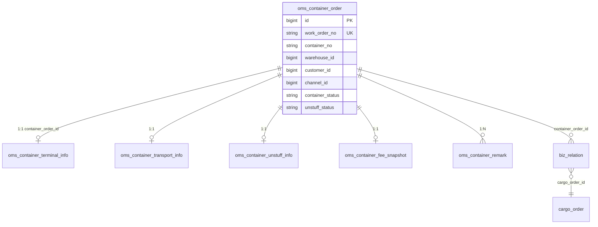

# 02 OMS 模块 — 后端设计说明

> **定位**：海外仓 **订单管理系统（OMS）** 后端实现说明，覆盖海柜、柜内委托单、订单追踪、事件日志及配套能力。  
> **前置阅读**：[01-核心-后端设计.md](./01-核心-后端设计.md)（`biz_root` / `cargo_order` / `shipment` / `biz_relation`）  
> **接口字段真相源（联调）**：前端 `apps/web-antd/src/views/oms/container/backend-integration.md` + `docs/后端对接手册.md`  
> **代码模块**：`yudao-module-oms`（需在 `yudao-server/pom.xml` 启用）  
> **版本**：2026-05

---

## 1. 文档说明

### 1.1 读者与范围

| 读者 | 使用方式 |
|------|----------|
| 产品/测试 | §2 页面、§5 状态机、§6 验收 |
| 后端 | §3 表结构、§7 服务逻辑、§8 API |
| 前端 | §8 API 与 §9 列表字段（与 `cargo-order-display.ts` 对齐） |
| Agent | §11 进度与缺口 |

### 1.2 文档冲突处理顺序

1. `container/backend-integration.md`（接口 JSON）
2. 本文档 §8、§9
3. 产品 PRD `03_oms_container_full_prd.md`（字段全集）
4. `02_oms_prd.md`（页面与交互）

---

## 2. 产品页面与后端映射

| 菜单 | 前端路由 | 后端 API 前缀 | 权限（典型） |
|------|----------|---------------|--------------|
| 海柜列表 | `/oms/container` | `/admin-api/oms/container` | `oms:container:view` |
| 海柜新建 | 弹窗 create-form | `POST .../create` | `oms:container:create` |
| 海柜编辑 | form.vue（仅头） | `PUT .../update` | `oms:container:edit` |
| 海柜详情 | `/oms/container/detail/:id` | `GET .../get`、`/timeline` | `oms:container:view` |
| 柜内订单 Tab | 详情内 orders-panel | `GET .../container/order/page` | `oms:container:view` |
| 柜内订单详情 | `.../order/:cargoOrderId` | `GET .../container/order/get` | `oms:order:query` |
| 订单追踪 | `/oms/order-tracking` | `/admin-api/oms/cargo-order` | `oms:order:list` |
| 事件日志 | `/oms/event-log` | `/admin-api/oms/biz-event` | 见菜单配置 |

**列设置（前端）**：`grid-storage.ts` — 海柜 `OMS_CONTAINER_LIST_V3`、追踪 `OMS_CARGO_ORDER_TRACKING_V2`；**后端不提供列偏好 API**，仅保证字段名一致。

**共享列定义**：`views/oms/shared/cargo-order-display.ts` → `useOmsCargoOrderVxeColumns`

---

## 3. OMS 表结构（海柜域 + 扩展）

> CORE 表见 [01-核心-后端设计.md](./01-核心-后端设计.md)。以下为 **OMS 海柜子域** 及 OMS 专用表。

### 3.1 海柜 ER（与子表）



### 3.2 `oms_container_order` — 海柜工单主表

| 项 | 说明 |
|----|------|
| **作用** | 海柜列表/详情/建单头；组织权限 **`warehouse_id`** |
| **无** `biz_root_id` | 与海柜业务主线解耦，见 CORE 红线 |

| 字段分组 | 字段 | 说明 |
|----------|------|------|
| 标识 | `work_order_no` | `WKSC-YYYYMMDD-XXXXXX` 系统生成 |
| | `container_no` | 4 字母+7 数字，建单校验 `^[A-Z]{4}\d{7}$` |
| | `bl_no` | 提单号 |
| 主体 | `customer_id`, `warehouse_id` | 客户、目的仓 |
| 柜型/渠道 | `container_type`, `channel_id` | 建单必填 **channelId**（非 transport_mode 必填） |
| | `transport_mode` | 默认 `SEA_FCL`，兼容旧字段 |
| 船运 | `carrier_code`, `vessel_name`, `voyage_no`, `route_code`, `pol_code`, `pod_code` | 列表/详情展示 |
| 时间 | `eta`, `atd`, `ata`, `pickup_lfd`, `return_lfd` | `terminal` 内 LFD 也可回写主表 |
| 状态 | `container_status`, `unstuff_status`, `exam_status` | 见 §5 |
| Hold | `is_on_hold`, `hold_type`, `hold_reason`, `hold_since` | 海柜级 |
| 汇总 | `order_total_count`, `order_completed_count` | 建单后更新柜内单数 |
| 建单 | `create_source` | `MANUAL` / `API` / `CUSTOMER_PORTAL` |
| 备注 | `remark`, `internal_remark` | 对外/内部 |
| 度量 | `gross_weight_kg`, `total_cbm`, `calc_risk_level` | |

**关联**：`biz_relation.container_order_id`；子表均 `container_order_id` UK 或 FK。

---

### 3.3 `oms_container_terminal_info` — 码头（1:1）

| 作用 | 海柜详情 Tab「海柜详情」之 terminal 块 |
|------|--------------------------------------|
| UK | `container_order_id` |

主要字段：`terminal_code`, `terminal_name`, `port_code`, `available_at`, `pickup_lfd`（码头维度，与主表 `pickup_lfd` 可并存）、查验相关 `exam_*` 等（v11）。

---

### 3.4 `oms_container_transport_info` — 运输（1:1）

| 作用 | 详情 transport：船名/航次、提柜/到仓、卡车、月台 |
|------|-----------------------------------------------|

字段：`vessel_name`, `voyage_no`, `trucker_*`, `picked_up_at`, `arrived_at`, `dock_no` 等。

---

### 3.5 `oms_container_unstuff_info` — 拆柜（1:1）

| 作用 | WMS 拆柜回写；详情 unstuff 块 |
|------|------------------------------|

字段：`wms_task_id`, `wms_unstuff_*`, `wms_actual_ctns`, `empty_reported_at`, `returned_at` 等。

---

### 3.6 其他海柜附属表

| 表 | 作用 |
|----|------|
| `oms_container_remark` | 多条备注 |
| `oms_container_fee_snapshot` | 费用快照 JSON |
| `oms_container_wms_snapshot` | WMS 快照 JSON |

---

### 3.7 `base_sales_channel` — 销售渠道（Base 模块）

| 作用 | 建单「渠道」下拉 `channelId` |
|------|------------------------------|
| API | `GET /admin-api/base/sales-channel/simple-list` |
| SQL | `oms-container-create-alter.sql` |

---

### 3.8 OMS 其他能力表（简述）

| 表 | 页面/能力 |
|----|-----------|
| `oms_alert_rule` / `oms_alert_instance` | 预警 |
| `oms_fee` / `oms_freeze_request` | 费用 |
| `oms_route_template` | 路由模板（配置） |

---

## 4. 建单产品设计（2026-05 UI）

### 4.1 入口与模式

| 模式 | 前端 | 后端 |
|------|------|------|
| **新建** | `create-form.vue`：Tab 基础资料 + Tab 订单明细 | `POST /oms/container/create` + `orders[]` |
| **编辑** | `form.vue`：仅海柜头 | `PUT /oms/container/update`，**无** `orders[]` |

### 4.2 海柜头必填（基础资料 Tab）

| 字段 | 类型 | 落库 |
|------|------|------|
| `containerNo` | string | `oms_container_order.container_no` |
| `blNo` | string | `bl_no` |
| `containerType` | string | `container_type` |
| `channelId` | number | `channel_id` |
| `warehouseId` | number | `warehouse_id` + 仓权限校验 |
| `customerId` | number | `customer_id` |
| `eta` | date | `eta` |

选填：`vesselName`, `voyageNo`, `carrierCode`, `routeCode`, `polCode`, `podCode`, `csUserId`, `createSource`, `remark`, `terminal{...}`

### 4.3 柜内订单 `orders[]`（订单明细 Tab）

每单 **至少 1 条**；字段落 `cargo_order` + 关联 `biz_relation`。

| 字段 | 必填 | 落库 |
|------|------|------|
| `warehouseCode` | 是 | 须与目的仓一致 → `warehouse_code` |
| `deliveryMethod` | 是 | `delivery_method` |
| `shipments` | 是（≥1） | 见下 |
| `orderNo` | 否 | 空则生成 `order_no` |
| `platform`, `addressType` | 否 | |
| `lfd`, `dwDate`, `dwStart/End` | 否 | 订单级 |
| `plannedCtns`, `grossWeightLbs`, `cbm` | 否 | 订单级 |
| 收件人/地址 | 否 | `consignee_*`, `delivery_*` |
| `remark`, `onHold` | 否 | `remark`, `on_hold` |

### 4.4 货件 `orders[].shipments[]`

每单 **至少 1 条**；落 `shipment` 表。

| 字段 | 必填 |
|------|------|
| `shipmentCode` | 是 |
| `poNo` | 是 |
| `dwDate` | 是 |
| `plannedCtns` | 是（≥1） |
| `grossWeightLbs` | 是 |
| `cbm` | 是 |
| `goodsName` | 是 |
| `dwStart/End` | 否 |
| `items[]` | 否 → `cargo_order_item` |

### 4.5 建单服务逻辑（实现）

| 类 | 方法 | 说明 |
|----|------|------|
| `OmsContainerController` | `create` | |
| `OmsContainerServiceImpl` | `create` | 若 `orders` 非空 → 委托 `OmsContainerCreateServiceImpl` |
| `OmsContainerCreateServiceImpl` | `createWithOrders` | **单事务** |

**事务步骤**：

1. 校验柜号、`channelId`、`orders`/每单 `shipments` 必填
2. `checkWarehousePermission`
3. `INSERT oms_container_order` + `saveTerminal`（LFD 可写主表）
4. 循环 `persistOrder`：biz_root → cargo_order → shipment(s) → item(s) → biz_relation → routeNodes
5. 更新 `order_total_count`；`recordBizEvent(CONTAINER_CREATED)`

---

## 5. 状态机

### 5.1 海柜 `container_status`

枚举：`OmsContainerStatusEnum`（如 `SAILING` 等）

| 操作 | API | 说明 |
|------|-----|------|
| 人工改状态 | `PUT /oms/container/update-status` | `reason` ≥ 10 字 |
| 建单默认 | — | `SAILING` |

### 5.2 拆柜 `unstuff_status`

枚举：`OmsUnstuffStatusEnum`；建单默认 `NOT_CREATED`；WMS 回写 `oms_container_unstuff_info`。

### 5.3 查验 `exam_status`

海柜主表；默认 `NONE`。

### 5.4 委托单 `fulfillment_status`

枚举：`OmsFulfillmentStatusEnum`

| 状态示例 | 说明 |
|----------|------|
| `PENDING_UNSTUFF` | 待拆柜 |
| `PENDING_DISPATCH` / `PRE_DISPATCHED` | 待/预派送 |
| `DISPATCHED` / `DEPARTED` | 在途 |
| `ON_HOLD` | 暂扣（操作） |
| `POD_SIGNED` / `COMPLETED` | 完成 |
| `EXCEPTION` | 异常 |

| 操作 | 柜内 API | 追踪 API |
|------|----------|----------|
| 预派送 | `POST .../container/order/pre-dispatch` | `POST .../cargo-order/batch-pre-dispatch` |
| 暂扣/解除 | `POST .../hold`, `release-hold` | — |
| 改状态 | — | `PUT .../cargo-order/update-status` |

状态变更后：`OmsOrderRouteNodeService.syncFromFulfillmentStatus`

---

## 6. 枚举字典

### 6.1 `createSource`

| 值 | 说明 |
|----|------|
| `MANUAL` | 运营自建 |
| `API` | API |
| `CUSTOMER_PORTAL` | 客户门户 |

### 6.2 `addressType`

`COMMERCIAL` / `RESIDENTIAL`

### 6.3 `deliveryMethod`

`TRUCK`, `BULK_TRANSFER`, `WAREHOUSE_SHELVING`, `WILL_CALL`, `EXPRESS`, `LOCAL`, `LTL`

### 6.4 `platform`（示例）

`AMAZON_FBA`, `WALMART`, `SHOPIFY`, `SELF_SHIP`

---

## 7. 服务与包结构

```
yudao-module-oms/
├── controller.admin.container/          OmsContainerController
├── controller.admin.container.order/    OmsContainerOrderController
├── controller.admin.cargo/              OmsCargoOrderController
├── controller.admin.event/              OmsBizEventController
├── service.container/
│   ├── OmsContainerServiceImpl          page/get/update/timeline
│   ├── OmsContainerCreateServiceImpl    嵌套建单
│   └── OmsContainerTimelineBuilder
├── service.container.order/
│   ├── OmsContainerOrderServiceImpl     柜内操作/汇总
│   └── OmsContainerOrderQueryService    柜内 page/get + 货件
├── service.cargo/
│   ├── OmsCargoOrderServiceImpl         追踪 page/get/stats
│   ├── OmsCargoOrderEnrichmentService   客户/仓库/海柜/货件/风险
│   ├── OmsShipmentAssemblyService       货件批量
│   └── OmsShipmentDisplayHelper         聚合字符串
└── framework.web/OmsRequestParamUtils   拒绝 row_* 主键
```

---

## 8. API 契约（实现基线）

> 统一前缀：`/admin-api` + 模块路径。响应体芋道标准 `{ code, data, msg }`。

### 8.1 海柜 `/oms/container`

| 方法 | 路径 | 权限 | 说明 |
|------|------|------|------|
| POST | `/create` | `oms:container:create` | 有 `orders[]` 走嵌套建单；返回 `data`=海柜 id |
| PUT | `/update` | `oms:container:edit` | 仅头；**TODO** 有柜内单禁改 warehouseId |
| GET | `/page` | `oms:container:view` | `@OrgDataScope`；enrich 渠道/客户/仓库名 |
| GET | `/get` | `oms:container:view` | `container` + terminal/transport/unstuff/fee |
| GET | `/timeline` | `oms:container:view` | 泳道 |
| PUT | `/update-status` | — | reason≥10 |
| POST | `/copy` | `oms:container:create` | |
| POST | `/remark/create` | — | |

**列表 `container` 扩展字段**：`channelId`, `channelName`, `vesselName`, `voyageNo`, `routeCode`, `polCode`, `createSource`, `remark` 等。

### 8.2 柜内订单 `/oms/container/order`

| 方法 | 路径 | 权限 |
|------|------|------|
| GET | `/page?containerOrderId=` | `oms:container:view` |
| GET | `/get` / `/get-detail` | `oms:order:query` |
| GET | `/shipment/list` | `oms:order:query` |
| GET | `/summary` | `oms:container:view` |
| POST | `/bind`, `/pre-dispatch`, `/hold`, … | 见 Controller |

**参数**：`cargoOrderId` 与 `id` 等价；**禁止** `row_*`（`OmsRequestParamUtils` → 400）。

**列表 VO**：`OmsContainerCargoOrderRespVO`

### 8.3 委托单追踪 `/oms/cargo-order`

| 方法 | 路径 | 权限 |
|------|------|------|
| GET | `/page` | `oms:order:list` |
| GET | `/stats` | `oms:order:list` |
| GET | `/get` | `oms:order:query` |
| GET | `/export` | 同 page |
| GET | `/timeline` | |
| PUT | `/update-status` | |
| POST | `/batch-pre-dispatch` | |

**列表 VO**：`OmsCargoOrderRespVO`（含 CORE 对齐字段 + 追踪扩展）

### 8.4 基础资料

| 方法 | 路径 |
|------|------|
| GET | `/base/sales-channel/simple-list` |

### 8.5 事件日志 `/oms/biz-event`

| 方法 | 路径 |
|------|------|
| GET | `/page`, `/get` |
| POST | `/retry` |

---

## 9. 列表/详情字段（与前端列对齐）

### 9.1 柜内订单 & 委托单追踪 — 共用列（`cargo-order-display`）

以下字段 **两套 page 均应返回**（追踪页另加 §9.2）：

| 字段 | 说明 |
|------|------|
| `id` | **cargo_order.id**（数字） |
| `orderNo`, `warehouseCode`, `platform`, `addressType` | |
| `deliveryMethod` | 派送方式 |
| `customerName` | 列表 enrichment |
| `fulfillmentStatus` | |
| `lfd`, `dwDate`, `dwStart`, `dwEnd` | |
| `plannedCtns`, `wmsActualCtns`, `grossWeightLbs`, `cbm` | |
| `consigneeName/Phone/Email` | |
| `deliveryAddress/City/State/Zip` | |
| `appointmentNo`, `remark`, `onHold`, `goodsName` | |
| `wmsExceptionCtns`, `calcAgeDays`, `createTime` | |
| `shipments[]` | 列表**不含** `items` |
| `shipmentCodesAgg`, `poNosAgg` | 逗号聚合，后端计算 |

**货件元素** `shipments[]`：`shipmentCode`, `poNo`, `dwDate`, `plannedCtns`, `grossWeightLbs`, `cbm`, `goodsName`

**详情**：`shipments[].items[]` 含 `skuCode`, `skuName`, `plannedQty`

### 9.2 订单追踪扩展列

`warehouseId`, `warehouseName`, `containerNo`, `workOrderNo`, `eta`, `endCustomerName`, `displayCustomerName`, `riskFlags`, `riskDwUrgent`, `riskLfdUrgent`, `riskLfdOverdue`, `calcRiskLevel`, `currentRouteNode`, `relatedContainer`, `earliestDwDate`, `dwTimeWindow`（兼容）

### 9.3 海柜列表列（`OMS_CONTAINER_LIST_V3`）

见 `OmsContainerOrderRespVO`：`workOrderNo`, `containerNo`, `customerName`, `warehouseName`, `channelName`, `containerStatus`, `eta`, `pickupLfd`, …

### 9.4 详情三块数据区别

| 数据 | 接口字段 | 用途 |
|------|----------|------|
| 履约路由 | `routeNodes[]` | Tab1 里程碑 |
| 业务时间轴 | `timeline[]`（biz_timeline） | Tab3 / 海柜全局时间轴 |
| 事件日志 | `/oms/biz-event/page` | 独立菜单，可消费重试 |

---

## 10. 组织数据权限

| 机制 | 说明 |
|------|------|
| 模块 | `yudao-module-org-permission` |
| 注解 | `@OrgDataScope(tableClass=..., warehouseColumn="warehouse_id")` |
| 写校验 | `OrgPermissionApi.checkWarehousePermission` |

**挂点**：

- `OmsContainerServiceImpl.page/export`
- `OmsContainerOrderServiceImpl.pageByContainer`
- `OmsCargoOrderServiceImpl.page/stats`

Header 见 `后端对接手册` §3.1。

---

## 11. 实现进度、风险与 SQL

### 11.1 已完成（后端）

- [x] 海柜 CRUD、嵌套建单、timeline
- [x] 柜内 page/get/shipment/操作
- [x] 委托单 page/get/stats、enrichment、货件聚合
- [x] 渠道 simple-list、组织数据权限
- [x] 列表 `shipments[]` + `shipmentCodesAgg`/`poNosAgg`
- [x] 委托单列表字段与柜内对齐（`deliveryMethod`、收件人、`dwDate` 等）

### 11.2 待办 / 风险

- [ ] 编辑海柜：已有 `LOADED_IN` 时禁止改 `warehouseId`
- [ ] 列偏好仅存前端 localStorage
- [ ] 错误码段 `1_020_*`（非手册 `1_004_*`）
- [ ] DB：Workbench 与 `application-*.yaml` 库不一致会导致「自检有列、运行报错」

### 11.3 SQL 执行顺序

1. `oms-tables.sql`
2. `oms-tables-v11-alter.sql`（仅一次）
3. 建单 patch：`oms-container-create-alter.sql` 或分拆 patch 三份
4. `oms-container-lifecycle-alter.sql`
5. 可选：`oms-route-node-migrate.sql`、`oms-menu.sql`、`oms-mock-data.sql`

自检：`oms-schema-check.sql`

### 11.4 编译与启动

```bash
mvn compile -pl yudao-module-oms,yudao-server -am -DskipTests
```

---

## 12. 验收要点（联调）

1. `POST /oms/container/create` 最小 `orders[0].shipments[0]` 成功返回海柜 id  
2. 无 `orders` → 400 `OMS_CONTAINER_ORDERS_REQUIRED`  
3. 货件缺必填 → 400 `OMS_CONTAINER_SHIPMENT_FIELD_REQUIRED`  
4. `GET /oms/container/order/page` 行 `id` 为数字；含 `shipments[]`、聚合字段  
5. `GET /oms/cargo-order/page` 字段与柜内列表列一致，含 `containerNo`  
6. `cargoOrderId=row_311` → 400 友好提示  
7. `channelId` 关联 `base_sales_channel`  

---

*核心表与关联详见 [01-核心-后端设计.md](./01-核心-后端设计.md)。*
